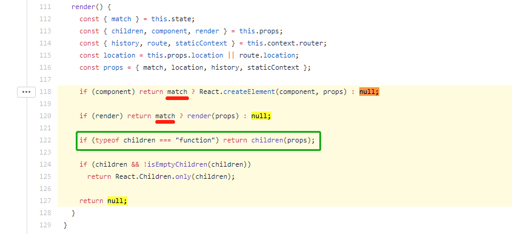

# CacheRoute

Route with cache for `react-router` like `keep-alive` in Vue.

Will cache the Route **ONLY** while going forward

**React v16.3+**

**React-Router v4+**

## Problem

Using `Route`, component can not be cached while going forward or back which lead to losing data and interaction


## Reason & Solution

Component would be unmounted while `Route` being unmatched 

After reading source code of `Route` we can found that 

Using `children` prop as a function could help to control rendering behavior.

Use "hide node" instead of "delete node" would fix this issue.

https://github.com/ReactTraining/react-router/blob/master/packages/react-router/modules/Route.js#L118-L127



## Effect with CacheRoute


## Install

```bash
npm install react-router-cache-route --save
```
or 

```bash
yarn add react-router-cache-route
```

## Usage

Can use `CacheRoute` with `component` prop, or

Using `cacheComponent` work with `Route`'s `children` prop 

**DO NOT** put it in `Switch` component

```javascript
import React from 'react'
import { HashRouter as Router, Switch, Route } from 'react-router-dom'
import CacheRoute, { cacheComponent } from 'react-router-cache-route'

import List from './components/List'
import Item from './components/Item'

import List2 from './components/List2'
import Item2 from './components/Item2'

const App = () => (
  <Router>
    <CacheRoute exact path="/list" component={List} />
    <Route exact path="/list2" children={cacheComponent(List2)} />
    <Switch>
      <Route exact path="/item/:id" component={Item} />
      <Route exact path="/item2/:id" component={Item2} />
    </Switch>
  </Router>
)

export default App
```

## Lifecycles

Component with CacheRoute will accept one prop named `cacheLifecycles` which contains two functions to inject customer Lifecycle `didCache` and `didRecover`

```javascript
import React, { Component } from 'react'

export default class List extends Component {
  constructor(props, ...args) {
    super(props, ...args)

    props.cacheLifecycles.didCache(this.componentDidCache)
    props.cacheLifecycles.didRecover(this.componentDidRecover)
  }
  
  componentDidCache = () => {
    console.log('List cached')
  }

  componentDidRecover = () => {
    console.log('List recovered')
  }

  render() {
    return (
      // ...
    )
  }
}

```

