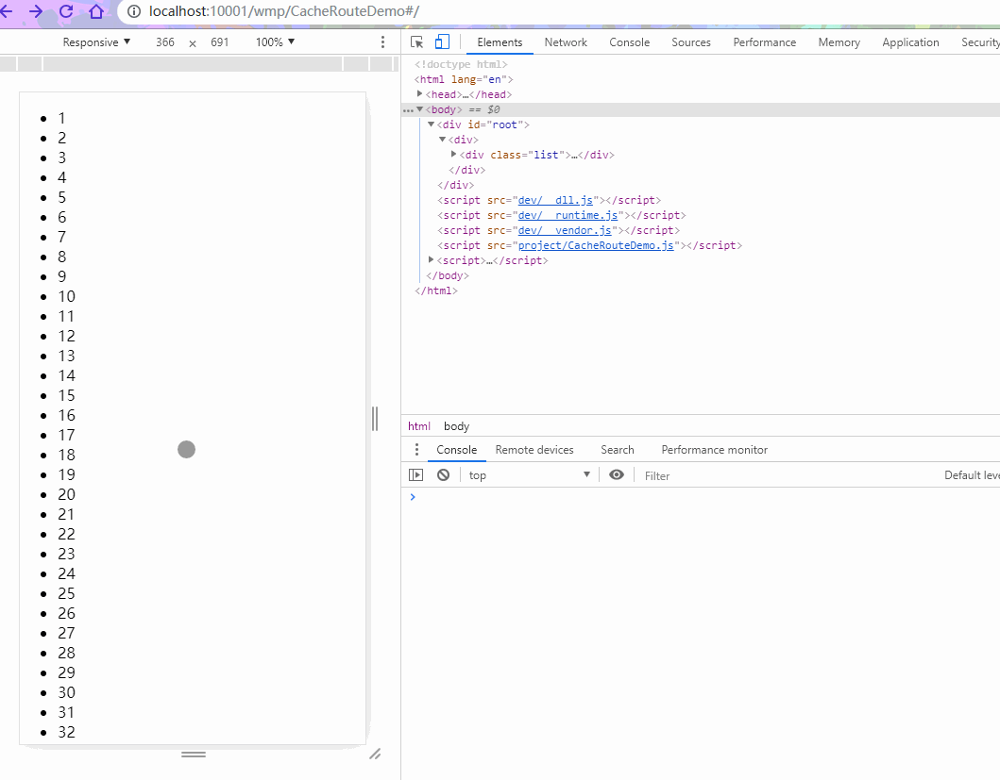

# CacheRoute

[](https://github.com/CJY0208/react-router-cache-route)
[](https://github.com/CJY0208/react-router-cache-route)

[English](./README.md) | 中文说明

搭配 `react-router` 工作的、带缓存功能的路由组件，类似于 `Vue` 中的 `keep-alive` 功能

**如果只想要单纯的 `<KeepAlive />` 功能，试试 [react-activation](https://github.com/CJY0208/react-activation)**

**React v15+**

**React-Router v4+**

---



---

## 遇到的问题

使用 `Route` 时，路由对应的组件在前进或后退无法被缓存，导致了 **数据和行为的丢失**

例如：列表页滚动到底部后，点击跳转到详情页，返回后会回到列表页顶部，丢失了滚动位置和数据的记录

---

## 原因 & 解决方案

`Route` 中配置的组件在路径不匹配时会被卸载，对应的真实节点也将从 dom 树中删除

在阅读了 `Route` 的源码后我们发现可以将 `children` 当作方法来使用，以帮助我们手动控制渲染的行为

**隐藏替代删除** 可以解决遇到的问题

https://github.com/ReactTraining/react-router/blob/master/packages/react-router/modules/Route.js#L41-L63

---

## 安装

```bash
npm install react-router-cache-route --save
# or
yarn add react-router-cache-route
```

---

## 使用方法

使用 `CacheRoute` 替换 `Route`

使用 `CacheSwitch` 替换 `Switch`（因为 `Switch` 组件只保留第一个匹配状态的路由，卸载掉其他路由）

```javascript
import React from 'react'
import { HashRouter as Router, Route } from 'react-router-dom'
import CacheRoute, { CacheSwitch } from 'react-router-cache-route'

import List from './views/List'
import Item from './views/Item'

const App = () => (
  <Router>
    <CacheSwitch>
      <CacheRoute exact path="/list" component={List} />
      <Route exact path="/item/:id" component={Item} />
      <Route render={() => <div>404 未找到页面</div>} />
    </CacheSwitch>
  </Router>
)

export default App
```

---

## CacheRoute 属性说明

| 名称                          | 类型                  | 默认值                                                         | 描述                                                                                                      |
| ----------------------------- | --------------------- | -------------------------------------------------------------- | --------------------------------------------------------------------------------------------------------- |
| when                          | `String` / `Function` | `"forward"`                                                    | 用以决定何时使用缓存功能                                                                                  |
| className                     | `String`              | -                                                              | 作用于包裹容器上的样式类名                                                                                |
| behavior                      | `Function`            | `cached => cached ? { style: { display: "none" }} : undefined` | 返回一个作用于包裹容器的 `props`，控制包裹容器的渲染方式                                                  |
| cacheKey                      | `String`              | -                                                              | 增加此属性用于命令式控制缓存                                                                              |
| multiple （React v16.2+）     | `Boolean` / `Number`  | `false`                                                        | 允许按动态路由参数区分不同缓存，值为数字时表示最大缓存份数，超出最大值时将清除最早更新的缓存              |
| unmount （实验性）            | `Boolean`             | `false`                                                        | 缓存时是否卸载 dom 节点，用于节约性能（单独使用将导致恢复时滚动位置丢失，可配合 saveScrollPosition 修复） |
| saveScrollPosition （实验性） | `Boolean`             | `false`                                                        | 用以保存滚动位置                                                                                          |

`CacheRoute` 仅是基于 `Route` 的 `children` 属性工作的一个封装组件，不影响 `Route` 本身属性的功能

其余属性请参考 https://reacttraining.com/react-router/

---

### `when` 取值说明

类型为 `String` 时可取以下值：

- **[forward]** 发生**前进**行为时缓存，对应 react-router 中的 `PUSH` 或 `REPLACE` 事件
- **[back]** 发生**后退**行为时缓存，对应 react-router 中的 `POP` 事件
- **[always]** 离开时一律缓存路由，无论前进或者后退

类型为 `Function` 时，将接受组件的 `props` 作为第一参数，返回 `true/false` 决定是否缓存

---

## CacheSwitch 属性说明

| 名称  | 类型       | 默认值                                   | 描述                                                                                                                                                                                                                                                            |
| ----- | ---------- | ---------------------------------------- | --------------------------------------------------------------------------------------------------------------------------------------------------------------------------------------------------------------------------------------------------------------- |
| which | `Function` | `element => element.type === CacheRoute` | `<CacheSwitch>` 默认只保存第一层子节点中类型为 `CacheRoute` 的节点, `which` 属性是一个将获得待渲染 React 节点实例的方法, 通过返回 `true/false` 来决定 `<CacheSwitch>` 是否需要保存它，参考 [#55](https://github.com/CJY0208/react-router-cache-route/issues/55) |

---

## 额外的生命周期

使用 `CacheRoute` 的组件将会得到一个名为 `cacheLifecycles` 的属性，里面包含两个额外生命周期的注入函数 `didCache` 和 `didRecover`，分别在组件 **被缓存** 和 **被恢复** 时触发

```javascript
import React, { Component } from 'react'

export default class List extends Component {
  constructor(props) {
    super(props)

    props.cacheLifecycles.didCache(this.componentDidCache)
    props.cacheLifecycles.didRecover(this.componentDidRecover)
  }

  componentDidCache = () => {
    console.log('List cached')
  }

  componentDidRecover = () => {
    console.log('List recovered')
  }

  render() {
    return (
      ...
    )
  }
}
```

---

## 手动清除缓存

使用 `cacheKey` 和 `dropByCacheKey` 函数来手动控制缓存

```javascript
import CacheRoute, { dropByCacheKey, getCachingKeys } from 'react-router-cache-route'

...
<CacheRoute ... cacheKey="MyComponent" />
...

console.log(getCachingKeys()) // 如果 `cacheKey` prop 为 'MyComponent' 的缓存路由已处于缓存状态，将得到 ['MyComponent']
...

dropByCacheKey('MyComponent')
...
```
